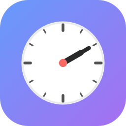

<p align="center">
  
</p>

<h1 align="center">MenuClock</h1>

<p align="center">
  <strong>World clocks, calendar events, and weather — right in your Mac's menu bar.</strong>
</p>

<p align="center">
  <a href="https://github.com/satsdisco/MenuClock/releases/latest"></a>
  <a href="https://github.com/satsdisco/MenuClock/actions/workflows/build.yml"></a>
  
  
  <a href="LICENSE"></a>
</p>

<p align="center">
  <em>Native SwiftUI. No Electron. No web views. No third-party dependencies. No telemetry.</em>
</p>

---

## Install

1. **[Download the latest release](https://github.com/satsdisco/MenuClock/releases/latest)** (`MenuClock.app.zip`, ~3.5 MB)
2. Unzip and drag `MenuClock.app` to `/Applications`
3. Double-click to launch — it's signed and notarized by Apple, so no Gatekeeper warnings

> MenuClock lives in your menu bar. There's no Dock icon — that's intentional. Look for the clock in the top-right of your screen.

---

## Features

### World Clocks

- Search any of **68,000+ cities worldwide** — type "Meridian" and see both Idaho and Mississippi, each with their state name
- Accent-insensitive search: `reykjavik` finds Reykjav&iacute;k
- Local time always shown at the top with a location indicator
- Today / Tomorrow / Yesterday labels for each time zone
- Add, remove, reorder, and rename clocks in Settings
- Bundled city database from [GeoNames](https://www.geonames.org) — no network needed

### Calendar Events

- Next 5 upcoming events pulled from Apple Calendar via EventKit
- Filter by calendar source — collapsible groups for iCloud, Google, Exchange, etc.
- Colored dot matching each calendar's color
- Click any event to jump to it in Calendar.app
- Read-only — MenuClock never modifies your calendars

### Weather (Opt-in)

- Current temperature and weather icon next to each world clock
- Powered by [Open-Meteo](https://open-meteo.com) — free, no API key, no account, no tracking
- Only sends the city's latitude/longitude — nothing else
- Cached for 15 minutes per clock
- Off by default — enable it in Settings with one toggle

### Meeting Planner

- Pick any moment in time and see it rendered across every configured zone
- Quick jumps: **Now**, **+1h**, **+2h**, **Tomorrow 9 AM**, **Friday 10 AM**
- Color-coded suitability for each zone:
  - **Green** — working hours (9 AM – 6 PM)
  - **Orange** — early morning or evening (7–9 AM, 6–10 PM)
  - **Red** — sleeping hours
- **Copy as text** puts a formatted summary on your clipboard, ready for Slack or email

### Menu Bar

- Show local time only, or local + a secondary world clock
- City codes auto-derived from labels: "New York" &rarr; NY, "Meridian" &rarr; MER
- Choose your separator: `·` `•` `|` `—` `/` or just spacing
- Live preview in Settings so you see exactly what the menu bar will look like

### More

- **Launch at login** via macOS `SMAppService`
- **12-hour / 24-hour override** independent of system locale
- **Celsius / Fahrenheit override** independent of locale
- **3-step onboarding** on first launch (welcome, calendar permission, weather opt-in)
- **About window** with version, GitHub links, and acknowledgments
- Follows system **light and dark mode** automatically
- **SF Symbols** for every icon — no custom image assets
- **App Sandbox** with only calendars + network (for weather) entitlements
- **Hardened runtime**, signed with Developer ID, **notarized by Apple**

---

## Screenshots

> **Coming soon** — pull requests with screenshots welcome!

<!-- 
Suggested screenshots to add:
- Menu bar showing dual clocks
- Dropdown with world clocks + weather + events
- Meeting Planner window
- Settings window
- City search picker
-->

---

## Build from source

### Quick build (no Xcode required)

MenuClock can be built with just the macOS Command Line Tools — no Xcode.app needed.

**First time only** — fetch the city database:

```bash
./build/fetch_cities.sh
```

**Build and run:**

```bash
./build.sh          # build only
./build.sh run      # build, kill previous instance, launch
```

The build script compiles all Swift sources with `swiftc`, assembles the `.app` bundle, generates the app icon (if missing), and ad-hoc codesigns it.

### With Xcode

```bash
open MenuClock.xcodeproj
```

Cmd+R to build and run. Xcode will offer to create a scheme on first open — accept it.

---

## Architecture

Clean MVVM with separate files for models, managers, view models, and views.

```
MenuClock/
├── MenuClockApp.swift          # App entry, MenuBarExtra + Window scenes
├── AppDelegate.swift           # Drives onboarding + about windows
│
├── Models/
│   ├── WorldClock.swift        # City + timezone + coordinates
│   └── AppSettings.swift       # MenuBarMode, TimeFormatStyle, MenuBarSeparator enums
│
├── Managers/
│   ├── SettingsManager.swift   # Published settings, UserDefaults persistence
│   ├── ClockTicker.swift       # Minute-aligned timer, publishes `now`
│   ├── CalendarManager.swift   # EventKit wrapper, permission handling
│   ├── CityDatabase.swift      # Loads + searches the bundled cities.tsv
│   ├── WeatherManager.swift    # Open-Meteo client, 15-min cache, parallel fetch
│   ├── LaunchAtLoginManager.swift  # SMAppService wrapper
│   └── TimeFormatting.swift    # Shared date formatter honoring 12/24h override
│
├── ViewModels/
│   └── MenuBarViewModel.swift  # Computes menu bar title string reactively
│
├── Views/
│   ├── MenuBarTitleView.swift  # The text rendered in the menu bar itself
│   ├── DropdownView.swift      # Main dropdown: clocks + events + footer
│   ├── WorldClockRow.swift     # Single clock row with weather + day label
│   ├── EventRow.swift          # Single event row with calendar dot
│   ├── SettingsView.swift      # All settings: general, menu bar, weather, events, clocks
│   ├── TimeZonePickerView.swift    # City search with flags + time preview
│   ├── MeetingPlannerView.swift    # The meeting planner window
│   ├── OnboardingView.swift    # First-launch 3-step wizard
│   └── AboutView.swift         # Version, links, credits
│
├── Resources/
│   ├── Info.plist              # LSUIElement, calendar usage strings
│   └── cities.tsv             # 68k cities (GeoNames, fetched at build time)
│
└── Assets.xcassets/            # App icon (10 sizes, Swift-rendered)
```

---

## Privacy

**MenuClock makes zero network calls in its default configuration.**

| Data | Where it goes |
|---|---|
| Calendar events | Read locally via EventKit. Never leaves your machine. |
| World clock settings | Stored in local UserDefaults. Never transmitted. |
| City search | Searched against a bundled file. Fully offline. |
| Weather (opt-in only) | HTTPS to `api.open-meteo.com` with lat/lng coordinates only. No account, no API key. [Open-Meteo privacy policy](https://open-meteo.com/en/terms). |

No analytics. No crash reporting. No telemetry. No accounts. No tracking.

---

## Contributing

Contributions are welcome! Please:

1. Fork the repo and create a feature branch
2. Make sure `./build.sh` succeeds
3. Open a pull request with a clear description

**Good first issues:**
- Add screenshots to the README
- Unit tests for `MenuBarViewModel.compute` and `CityDatabase.search`
- Localization support (the UI is English-only today)

---

## Acknowledgments

- **City data** — [GeoNames](https://www.geonames.org) cities5000 dataset, CC BY 4.0
- **Weather data** — [Open-Meteo](https://open-meteo.com), CC BY 4.0
- **Icons** — SF Symbols by Apple

---

## License

[MIT](LICENSE) — do whatever you want with it.

---

<p align="center">
  <sub>Made with Swift, SwiftUI, and zero dependencies.</sub>
</p>
